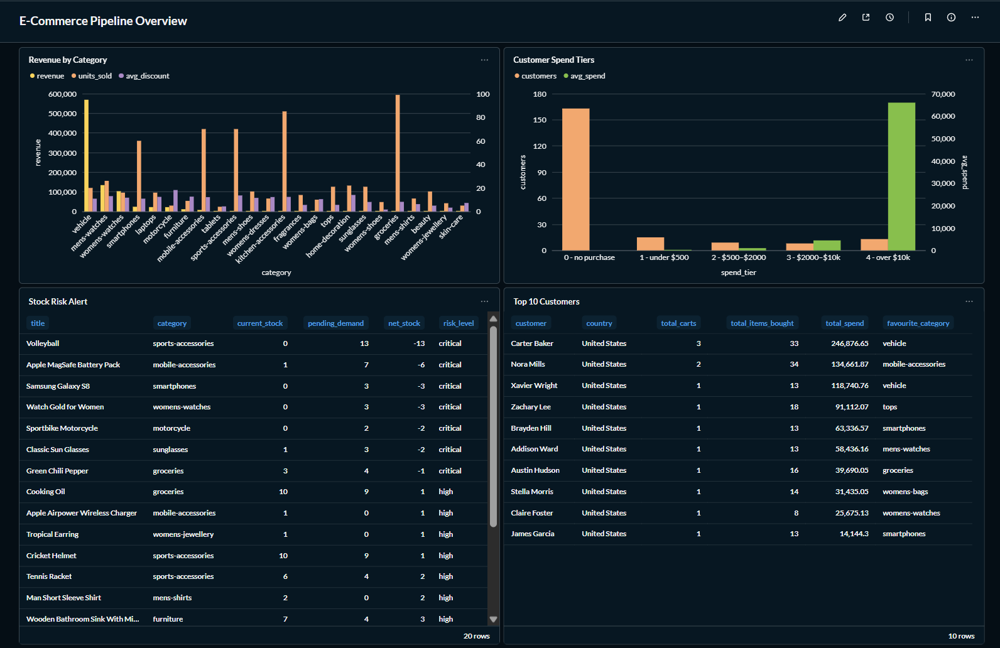

# E-Commerce Data Platform — Medallion Architecture

A production-style data engineering pipeline built with **PySpark**, **Apache Airflow**, **Docker**, and **Metabase**. Ingests e-commerce data from a REST API, processes it through Bronze → Silver → Gold layers, loads it into PostgreSQL, and visualizes it in a live dashboard.

---

## Architecture

```
┌─────────────────────────────────────────────────────────────┐
│                        Data Sources                         │
│                    DummyJSON REST API                        │
│              /products  /users  /carts                      │
└───────────────────────────┬─────────────────────────────────┘
                            │
                            ▼
┌─────────────────────────────────────────────────────────────┐
│                      BRONZE LAYER                           │
│                  Raw JSON — preserved as-is                 │
│         data/bronze/products/products_raw.json              │
│         data/bronze/users/users_raw.json                    │
│         data/bronze/carts/carts_raw.json                    │
└───────────────────────────┬─────────────────────────────────┘
                            │  PySpark
                            ▼
┌─────────────────────────────────────────────────────────────┐
│                      SILVER LAYER                           │
│         Cleaned, typed, deduplicated — Parquet              │
│                                                             │
│   products     partitioned by category                      │
│   users        partitioned by address_country  (PII removed)│
│   cart_items   partitioned by user_id                       │
└───────────────────────────┬─────────────────────────────────┘
                            │  PySpark
                            ▼
┌─────────────────────────────────────────────────────────────┐
│                       GOLD LAYER                            │
│         Business-ready — Parquet + PostgreSQL               │
│                                                             │
│   gold_customer_360         one row per user                │
│   gold_product_performance  one row per product             │
│   gold_stock_risk           operational risk table          │
└───────────────────────────┬─────────────────────────────────┘
                            │
                            ▼
┌──────────────────┐    ┌───────────────────────────────────┐
│   PostgreSQL     │    │           Metabase                │
│  ecommerce_dw    │───▶│   E-Commerce Pipeline Overview    │
│  (Docker)        │    │   dashboard — localhost:3000       │
└──────────────────┘    └───────────────────────────────────┘
                            ▲
                            │
┌─────────────────────────────────────────────────────────────┐
│                   Apache Airflow                            │
│           Orchestrates the full pipeline daily              │
│           Fan-out Silver tasks run in parallel              │
│           Fan-out Gold tasks run after all Silver pass      │
│           UI — localhost:8080                               │
└─────────────────────────────────────────────────────────────┘
```

---

## Project Structure

```
ecommerce-data-platform-medallion/
│
├── docker-compose.yml          # PostgreSQL + Airflow + Metabase
├── spark_session.py            # Shared SparkSession factory
├── postgres_writer.py          # Shared JDBC write utility
├── requirements.txt            # Python dependencies
├── check.py                    # Silver layer health check
│
├── bronze/
│   └── ingest_bronze.py        # Fetches from DummyJSON API
│
├── silver/
│   ├── transform_products.py
│   ├── transform_users.py
│   └── transform_carts.py
│
├── gold/
│   ├── transform_gold_customer_360.py
│   ├── transform_gold_product_performance.py
│   ├── transform_gold_stock_risk.py
│   └── run_gold_pipeline.py
│
├── dags/
│   └── ecommerce_pipeline_dag.py   # Airflow DAG
│
├── jars/
│   └── postgresql-42.7.3.jar       # JDBC driver for Spark→Postgres
│
└── data/
    ├── bronze/                 # Raw JSON files
    ├── silver/                 # Cleaned Parquet (partitioned)
    ├── gold/                   # Analytical Parquet (partitioned)
    └── quality_reports/        # JSON reports per pipeline run
```

---

## Stack

| Layer | Tool |
|---|---|
| Ingestion | Python + Requests |
| Processing | PySpark 3.5 (local mode) |
| Storage | Apache Parquet (Snappy compression) |
| Serving | PostgreSQL 15 (Docker) |
| Orchestration | Apache Airflow 2.8 (Docker) |
| Dashboard | Metabase (Docker) |

---
## Dashboard



Live Metabase dashboard built on top of the PostgreSQL Gold tables, showing revenue by category, customer spend tiers, stock risk alerts, and top customers by lifetime value.
## Quick Start

### Prerequisites
- Python 3.11+
- Docker Desktop
- Java 11+ (required by Spark)

### 1. Clone and install dependencies

```bash
git clone https://github.com/YOUR_USERNAME/ecommerce-data-platform-medallion.git
cd ecommerce-data-platform-medallion

python -m venv venv
venv\Scripts\activate        # Windows
# source venv/bin/activate   # macOS/Linux

pip install -r requirements.txt
```

### 2. Download the Postgres JDBC driver

```bash
mkdir jars
# Windows
Invoke-WebRequest -Uri "https://jdbc.postgresql.org/download/postgresql-42.7.3.jar" -OutFile "jars/postgresql-42.7.3.jar"
# macOS/Linux
curl -o jars/postgresql-42.7.3.jar https://jdbc.postgresql.org/download/postgresql-42.7.3.jar
```

### 3. Start the infrastructure

```bash
# First time only — initialise Airflow
docker compose up airflow-init

# Start everything
docker compose up -d

# Verify all containers are healthy
docker compose ps
```

### 4. Run the pipeline manually

```bash
python bronze/ingest_bronze.py

python silver/transform_products.py
python silver/transform_users.py
python silver/transform_carts.py

python gold/transform_gold_customer_360.py
python gold/transform_gold_product_performance.py
python gold/transform_gold_stock_risk.py
```

### 5. Or trigger via Airflow

Open `http://localhost:8080` → login `admin / admin` → toggle DAG on → click ▶

### 6. View the dashboard

Open `http://localhost:3000` → login with your Metabase credentials

---

## Silver Layer — What gets cleaned

### Products
- Explodes nested JSON array into flat rows
- Enforces types (`price` → double, `stock` → int, `rating` → double)
- Normalizes strings: lower + trim on `category`, `availability_status`
- Replaces null `brand` with `"unknown"`
- Validates: `price > 0`, `rating` 0–5, `discount_percentage` 0–100
- Deduplicates on `id`
- Partitioned by `category`

### Users
- Flattens nested structs: `address`, `hair`, `company`, `bank`
- **Removes PII**: `password`, `ssn`, `cardNumber`, `iban`, `ip`, `macAddress` intentionally excluded
- Derives `age_derived` from `birth_date` (more reliable than the raw `age` field)
- Validates email format, age range 16–100
- Partitioned by `address_country`

### Carts
- Explodes nested product array into one row per cart × product line item
- Recomputes `line_total = price × quantity` and stores discrepancy vs API value (float precision detection)
- Validates `quantity > 0`, `unit_price > 0`, `discount_percentage` 0–100
- Partitioned by `user_id`

---

## Gold Layer — Business tables

### `gold_customer_360`
One row per user. Joins purchase behaviour from cart_items onto the user spine via left join — users with no purchases are zero-filled rather than dropped.

Key columns: `total_spend`, `avg_cart_value`, `avg_basket_size`, `favourite_category`, `avg_discount_captured_pct`, `total_savings`

### `gold_product_performance`
One row per product. Joins demand signals from cart_items onto the product catalogue.

Key columns: `total_units_sold`, `total_revenue`, `unique_buyers`, `price_drift` (avg sold price vs catalogue price), `demand_tier` (no_sales / low / medium / high)

### `gold_stock_risk`
One row per product. Operational table — computes `net_stock = current_stock - pending_demand` and assigns a `risk_level` (critical / high / medium / healthy).

Partitioned by `risk_level` so ops queries hit only one partition.

---

## Data Quality Reports

Every transform generates a timestamped JSON report in `data/quality_reports/` tracking:
- Row counts at each pipeline stage
- Records dropped by cause (duplicates vs failed filters)
- Null counts per column after cleaning
- Demand tier distribution (Gold product performance)
- Risk level distribution (Gold stock risk)

---

## Dashboard — E-Commerce Pipeline Overview

Built in Metabase on top of the PostgreSQL Gold tables.

| Panel | Query |
|---|---|
| Revenue by Category | SUM of revenue per category from `gold_product_performance` |
| Customer Spend Tiers | COUNT of users bucketed by total spend from `gold_customer_360` |
| Stock Risk Alert | Products with `risk_level` = critical or high from `gold_stock_risk` |
| Top 10 Customers | Ranked by total spend from `gold_customer_360` |

---

## Key Engineering Decisions

**Why Medallion Architecture?** Separating raw (Bronze), clean (Silver), and analytical (Gold) data means each layer has a single responsibility. Bronze is immutable — you can always reprocess from it. Silver is the source of truth for data quality. Gold is optimized for specific consumers.

**Why Parquet with partitioning?** Parquet's columnar format means analytical queries only read the columns they need. Partitioning means category-filtered queries on products only read one folder. Both together make Gold queries fast without an index.

**Why left join in customer_360?** An inner join would silently drop users who never made a purchase. Left join preserves all users — "registered but never purchased" is a meaningful business segment.

**Why expose `line_total_discrepancy`?** The DummyJSON API has float precision noise (`124.94999999999999`). Instead of silently correcting it, we store the discrepancy so downstream consumers can decide how to handle it. This is the correct data engineering approach — don't hide data quality issues.

**Why two Postgres databases in Docker?** Airflow's metadata (DAG runs, task states, logs) is kept in a separate `airflow` database from your data warehouse `ecommerce_dw`. Mixing them is a common mistake that makes both harder to manage.